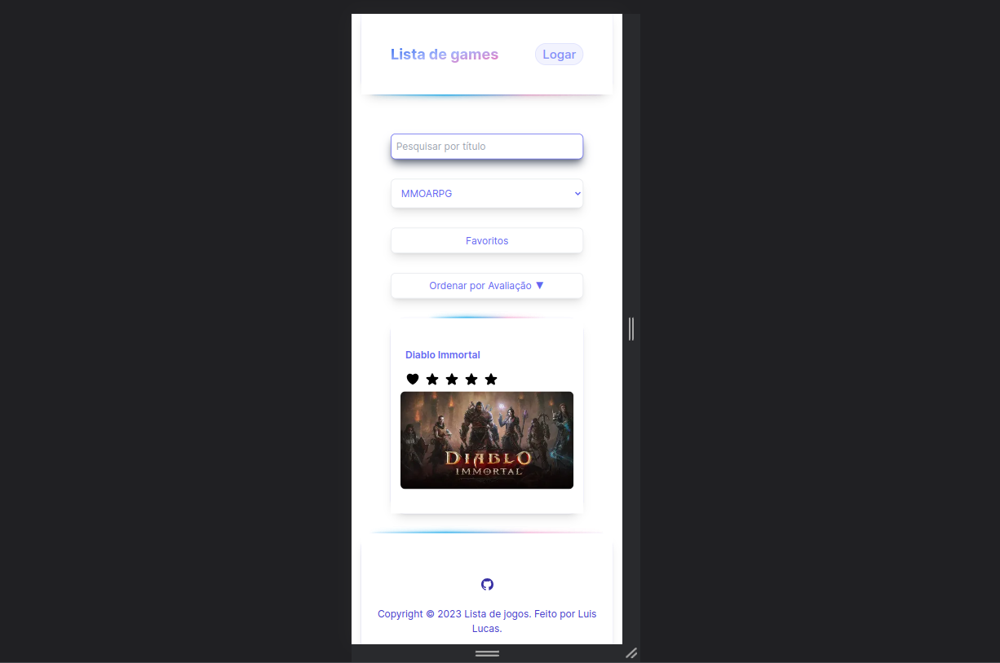

# Lista de jogos





## Configuração do Projeto

```sh
npm install
```

### Compilar e Hot-Reload para Desenvolvimento

```sh
npm run dev
```

### Compilar e minimizar para produção

```sh
npm run build
```

### Lint com [ESLint](https://eslint.org/)

```sh
npm run lint
```